# TurtleBot3 CV Navigation: Technical Details, Planners & Calibration

This document contains detailed system architecture diagrams, layout specifications, configuration procedures, parameters reference, and troubleshooting steps.

---

## Table of Contents
1. [System Architecture](#1-system-architecture)
2. [Workspace Layout](#2-workspace-layout)
3. [Algorithm & RL Framework Deep-Dive](#3-algorithm--rl-framework-deep-dive)
4. [SSH Setup For Robot Bringup](#4-ssh-setup-for-robot-bringup)
5. [Workspace & Camera Calibration](#5-workspace--camera-calibration)
6. [One-Time Background Capture](#6-one-time-background-capture)
7. [Planning & Control Parameters Reference](#7-planning-control-parameters-reference)
8. [Safety Behavior](#8-safety-behavior)
9. [Troubleshooting Guide](#9-troubleshooting-guide)
10. [What Not To Launch](#10-what-not-to-launch)

---

## 1. System Architecture

The control loop runs entirely on the operator host workstation, issuing direct `/cmd_vel` instructions over the local network to namespaced TurtleBots.

```mermaid
graph TD
    subgraph Sensing & Input
        Cam[Overhead Camera] -->|Raw Frames| GUI[GUI / EKF Localization Node]
        Odom[Robot Odometry] -->|Yaw Deltas| GUI
        Operator[Operator Clicks] -->|Initial Pose & Goals| GUI
    end

    subgraph Controller Dispatch
        GUI -->|Robot Poses & Goals| ModeSelect{Control Mode}
        ModeSelect -->|Scheduled Mode| CBS[CBS / Prioritized Planner]
        ModeSelect -->|RL Mode| RL[AERO-MARL Transformer Policy]
    end

    subgraph Safety & Execution
        CBS -->|Planned Paths| Follower[Path Follower & ORCA Filter]
        RL -->|Raw Actions| RLAdapter[Action Scaler & Filter]
        Follower -->|Velocity Commands| SafEnv[Safety Envelope Limits]
        RLAdapter -->|Velocity Commands| SafEnv
        SafEnv -->|/tb_N/cmd_vel| TB[TurtleBot3 Swarm]
    end
    
    style ModeSelect fill:#2c3e50,stroke:#34495e,stroke-width:2px,color:#fff
    style SafEnv fill:#e74c3c,stroke:#c0392b,stroke-width:2px,color:#fff
```



---

## 2. Workspace Layout

| Package | Purpose |
| :--- | :--- |
| [`src/cv_localization`](file:///home/adi2440/turtlebot_ws/src/cv_localization) | Camera detection, EKF sensor fusion, Click GUI, calibration, and the RL hardware adapter node. |
| [`src/multi_robot_swarm_planner`](file:///home/adi2440/turtlebot_ws/src/multi_robot_swarm_planner) | Direct controller, CBS/prioritized offline schedule planners, path follower, and local ORCA velocity filter. |
| [`src/multi_robot_navigation_ROS2`](file:///home/adi2440/turtlebot_ws/src/multi_robot_navigation_ROS2) | SSH remote execution utility for namespaced robot bringup on the lab swarm. |
| [`src/turtlebot3`](file:///home/adi2440/turtlebot_ws/src/turtlebot3) | TurtleBot3 driver, standard descriptions, and SDK dependencies. |

---

## 3. Algorithm & RL Framework Deep-Dive

### Theoretical Foundations
The path planning and collision avoidance methods implemented in this workspace follow the concepts from these publications:

* **Conflict-Based Search (CBS)**: Sharon et al., *"Conflict-Based Search For Optimal Multi-Agent Path Finding"*  
  👉 [Read CBS Paper](https://www.movingai.com/papers/sharon2015cbsjournal.html)
* **Safe Interval Path Planning (SIPP)**: Phillips and Likhachev, *"SIPP: Safe Interval Path Planning for Dynamic Environments"*  
  👉 [Read SIPP Paper](https://www.cs.cmu.edu/~maxim/files/sipp_icra11.pdf)
* **Optimal Reciprocal Collision Avoidance (ORCA)**: van den Berg et al., *"Reciprocal n-body Collision Avoidance"*  
  👉 [Read ORCA Project Page](https://gamma-web.iacs.umd.edu/ORCA/)
* **RVO2/ORCA Reference Implementation**  
  👉 [RVO2 Page](https://gamma-web.iacs.umd.edu/RVO2/)

### Repository Implementation Details
* **Offline Planner**: Uses a Conflict-Based Search (CBS) approach computed over temporal $A^*$ state spaces (as opposed to a full SIPP representation).
* **Local Velocity Filter**: An ORCA-inspired local collision avoidance filter. It adjusts commanded velocities when robots approach each other or workspace boundaries. 
* **Priority Yielding**: The local filter supports priority-aware yielding. Robots with higher priority break symmetric deadlocks. Priority is dynamic and updates based on how long a robot has been waiting or how far behind its schedule it is.
* **Crossing Gate**: An optional crossing gate token is available under `mppi.crossing_*` parameters for physical bottleneck environments, though it is disabled by default.

### Reinforcement Learning Checkpoint
The RL controller runs deterministic inference from an AERO-MARL policy checkpoint located at:
```text
/home/adi2440/Desktop/MARL_Shahil_Aditya/AERO-MARL
```

The model architecture utilizes the following components:
* **MAPPO (Multi-Agent PPO)**: Centralized-training, decentralized-execution actor-critic setup. At runtime, each agent computes its policy forward pass independently.
* **DGNN (Directed Graph Neural Network)**: Agents build a communication graph to share features. For three robots, the input graph size has an edge index shape of `2 x 9`.
* **Transformer Policy Wrapper**: The checkpoint is instantiated through `TransformerPolicy` wrapping `MultiAgentGnnTransformer`.
* **DSGD (Decentralized SGD)**: The policy configuration uses flags like `mappo_dgnn_dsgd`, `truelyDistributedGNN`, `truelyDistributed`, and `consensusLoss` during training.

#### Observation and Action Contracts
For $3$ robots, the observation space mirrors the `RealRobotManyGoToGoalEnv` simulator wrapper:
* **Per-agent Observation Dimension**: `17`
* **Shared Critic/State Dimension**: `24`
* **DGNN Edge Index**: `2 x 9`
* **Observation Fields**: Goal distance/bearing, last velocity command, sorted neighbor relative features, and shared global robot/goal states.

The policy generates continuous actions, mapped as follows:
* `raw_action[0]`: Forward linear velocity. $\text{tanh}(\text{raw\_action}[0]) \to [0, v_{\text{max}}]$ m/s.
* `raw_action[1]`: Angular velocity. $\text{tanh}(\text{raw\_action}[1]) \to [-w_{\text{max}}, +w_{\text{max}}]$ rad/s.
* `raw_action[2]`: Optional communication action (ignored by the hardware interface).

> [!WARNING]  
> The AERO-MARL `MAGoToGoalRunner` automatically scales continuous actions by `100` for simulator compatibility. **This is unsafe for real hardware.** The ROS node bypasses the runner and instantiates `TransformerPolicy` directly, scaling actions safely via custom `tanh` mapping, and wrapping the output in a strict physical limit filter.

---

## 4. SSH Setup For Robot Bringup

The workspace relies on remote execution of bringup scripts on the three TurtleBot3 Burgers. Passwordless SSH keys must be set up beforehand.

### 1. Key Generation
On the operator host PC:
```bash
ssh-keygen -t ed25519 -f ~/.ssh/turtlebot_lab_ed25519 -C turtlebot-lab
```

### 2. Copy Key to Robots
```bash
ssh-copy-id -i ~/.ssh/turtlebot_lab_ed25519.pub turtlebot@192.168.1.20
ssh-copy-id -i ~/.ssh/turtlebot_lab_ed25519.pub ubuntu@192.168.1.15
ssh-copy-id -i ~/.ssh/turtlebot_lab_ed25519.pub ubuntu@192.168.1.16
```

### 3. Verify Connection
Ensure you can log in without password prompts:
```bash
ssh -i ~/.ssh/turtlebot_lab_ed25519 turtlebot@192.168.1.20 hostname
ssh -i ~/.ssh/turtlebot_lab_ed25519 ubuntu@192.168.1.15 hostname
ssh -i ~/.ssh/turtlebot_lab_ed25519 ubuntu@192.168.1.16 hostname
```

> [!NOTE]  
> The remote robots expect the local workspace setup file at `~/turtlebot3_ws/install/setup.bash` and will source `/opt/ros/humble/setup.bash` on login.

---

## 5. Workspace & Camera Calibration

Whenever the overhead camera is physically adjusted, zoomed, or has its resolution changed, you must calibrate the camera-to-world homography.

### Workspace Frame Dimensions
* **Width x Height**: $3.048\text{ m} \times 3.048\text{ m}$ (10 ft $\times$ 10 ft)
* **Coordinate Origin $(0,0)$**: Centered in the workspace
* **Axes**: `+x` points right in the camera view; `+y` points up.
* **Outer Boundaries**: $x, y \in [-1.524, +1.524]\text{ m}$
* **Safe Target Envelope**: Outer boundary minus `wall_margin_m` (default: $0.20\text{ m}$, keeping robots inside $x, y \in [-1.324, +1.324]\text{ m}$).

### Homography Calibration Run
1. Edit `src/cv_localization/config/config.yaml` to set `camera.device` (a persistent `/dev/v4l/by-id/...` device path is highly recommended).
2. Execute the calibration tool:
   ```bash
   cd ~/turtlebot_ws
   source /opt/ros/humble/setup.bash
   source install/setup.bash
   python3 src/cv_localization/cv_localization/calibrate_workspace.py \
     --config src/cv_localization/config/config.yaml \
     --output src/cv_localization/config/calibration.yaml \
     --width-m 3.048 \
     --height-m 3.048
   ```
3. In the window, click the four workspace corners in this exact sequence:
   1. **Top-Left**
   2. **Top-Right**
   3. **Bottom-Right**
   4. **Bottom-Left**
4. Press `Enter` to approve the calibration. The GUI will render a rectified birds-eye view and write the homography matrix to `src/cv_localization/config/calibration.yaml`.

---

## 6. One-Time Background Capture

The localization pipeline uses static background subtraction to track the robot blobs. A clean background reference image must be captured when the workspace is empty under stable lighting.

Save the reference image as:
```text
src/cv_localization/config/background.jpg
```

You can capture this image using the helper script below:
```bash
cd ~/turtlebot_ws
python3 - <<'PY'
from pathlib import Path
import time
import cv2
import yaml

config_path = Path("src/cv_localization/config/config.yaml")
output_path = Path("src/cv_localization/config/background.jpg")
cfg = yaml.safe_load(config_path.read_text())
cam = cfg.get("camera", {})
cap = cv2.VideoCapture(cam.get("device", 0))
if not cap.isOpened():
    raise SystemExit(f"Could not open camera {cam.get('device', 0)}")
fourcc = cam.get("fourcc")
if fourcc:
    cap.set(cv2.CAP_PROP_FOURCC, cv2.VideoWriter_fourcc(*fourcc))
cap.set(cv2.CAP_PROP_FRAME_WIDTH, cam.get("width", 1280))
cap.set(cv2.CAP_PROP_FRAME_HEIGHT, cam.get("height", 960))
cap.set(cv2.CAP_PROP_FPS, cam.get("fps", 30))
for _ in range(30):
    cap.read()
    time.sleep(0.03)
ok, frame = cap.read()
cap.release()
if not ok:
    raise SystemExit("Camera read failed")
output_path.parent.mkdir(parents=True, exist_ok=True)
cv2.imwrite(str(output_path), frame)
print(f"Saved {output_path}")
PY
```

> [!IMPORTANT]  
> If `background.jpg` is not present, the launches will fail immediately. 

---

## 7. Planning & Control Parameters Reference

Configuration settings are stored in:
```text
src/cv_localization/config/config.yaml
```

### Configuration Parameters Table

| Parameter | Default Value | Description |
| :--- | :--- | :--- |
| `mppi.control_mode` | `scheduled` | Default controller mode (`scheduled` or legacy `mppi`). RL launch ignores this and uses the RL node directly. |
| `mppi.planner_algorithm` | `cbs` | Choice of planner (`cbs` or `prioritized`). |
| `mppi.goal_radius_m` | `0.12` | Distance threshold where a robot is considered to have reached its goal. |
| `mppi.goal_termination_v_mps` | `0.0` | Linear velocity commanded to an RL robot after it reaches its goal. |
| `mppi.goal_termination_w_radps` | `0.0` | Angular velocity commanded to an RL robot after it reaches its goal. |
| `mppi.max_v_mps` | `0.2` | Maximum forward linear velocity (m/s). |
| `mppi.allow_reverse` | `true` | Allows planning and tracking reverse motions. |
| `mppi.max_reverse_v_mps`| `0.15` | Maximum reverse linear velocity (m/s). |
| `mppi.max_w_radps` | `1.0` | Maximum angular velocity (rad/s). |
| `mppi.wall_margin_m` | `0.20` | Minimum allowed distance from boundaries (m). |
| `mppi.min_live_spacing_m`| `0.35` | Spacing threshold under which all motion is halted. |
| `vlcm_collection.sample_rate_hz` | `30.0` | Live MA-VLCM WebDataset frame/state sampling rate. |
| `vlcm_collection.crop_to_workspace` | `true` | Save calibrated workspace-only overhead frames. |
| `vlcm_collection.image_size_px` | `224` | Square output size for saved `overhead.png` frames. |
| `mppi.safety_distance_m` | `0.25` | Spacing limit before trigger safety overrides. |
| `mppi.max_dv_step` | `0.05` | Linear acceleration slew limit (change per control tick). |
| `mppi.max_dw_step` | `0.5` | Angular acceleration slew limit (change per control tick). |
| `mppi.planning_clearance_m`| `0.35` | Obstacle clearance distance used during A* path planning. |
| `mppi.offline_grid_resolution_m`| `0.05` | Spatial resolution of the offline grid search. |
| `mppi.offline_time_step_s`| `0.5` | Time discretization step size for the temporal plan. |
| `mppi.cbs_max_nodes` | `1000` | Search node expansion limit for CBS. |
| `mppi.path_heading_gain`| `1.5` | Proportional gain for path tracking yaw error. |
| `mppi.reverse_heading_threshold_rad`| `2.2` | Angle error threshold above which reverse velocity is triggered. |
| `mppi.orca_filter_enabled`| `true` | Enables/Disables runtime ORCA-style avoidance. |
| `mppi.orca_time_horizon_s`| `3.0` | Lookahead time window for dynamic avoidance. |
| `mppi.orca_priority_enabled`| `true` | Enables priority-based yielding inside ORCA. |
| `mppi.orca_priority_wait_gain`| `0.1` | Scale factor to increase priority based on waiting duration. |
| `mppi.orca_priority_schedule_lag_gain`| `0.2` | Scale factor to increase priority based on path deviation/delay. |
| `mppi.boundary_slowdown_margin_m`| `0.15` | Distance from wall where linear velocity scaling begins. |

---

## 8. Safety Behavior

Both Scheduled and RL controllers pipe commands through a defensive hardware safety layer. A stop command (zero velocity) is dispatched instantly to all robots if any of these events occur:

* **Manual Stops**: Keypress `Space`, `Esc`, `q` in the GUI, or `/fleet_mppi/stop` service call.
* **Localization Stale**: No camera coordinate updates received for more than $0.5$ seconds.
* **Boundary Violation**: Robot centers enter the hard workspace boundary envelope.
* **Stale Odometry**: Odometry feedback from any robot stops.
* **Proximity Violation**: Distance between any two robots drops below `min_live_spacing_m`.
* **Goal Completion**: All robots arrive within the goal threshold.
* **RL Per-Agent Goal Hold**: In RL checkpoint mode, each robot inside `mppi.goal_radius_m` receives the configured terminal velocity, which defaults to zero linear and angular motion while the rest of the fleet finishes.

---

## 9. Troubleshooting Guide

### ❌ GUI fails immediately with "missing background" error
* **Resolution**: Capture a reference background frame using the Python script in [Section 4](#4-one-time-background-capture) and save it to `src/cv_localization/config/background.jpg`.

### ❌ RL launch exits immediately on startup
* **Resolution**:
  * Verify `model_dir` points to a valid PyTorch model file (e.g., `transformer_800.pt`).
  * Verify `aero_marl_root` points to the root of the AERO-MARL repository (containing `mat/` and other training folders).
  * Check for environment mismatch: activate the `ur5_control` conda environment or the environment containing PyTorch, and source the built workspace: `source install/setup.bash`.

### ❌ Service ready errors: "Cannot plan: service not ready"
* **Resolution**: The core controller node (either `mppi_direct_controller` or `cv_rl_direct_controller`) failed to launch or crashed. Check the console output for Python tracebacks, library conflicts, or missing dependencies.

### ❌ Detections are unstable or identities swap
* **Resolution**:
  * Ensure lighting is consistent. If room lighting changes, recapture `background.jpg`.
  * Adjust detection filters in `src/cv_localization/config/config.yaml`:
    * Increase/decrease `detection.background_diff_threshold` to isolate robots.
    * Tune `detection.min_blob_area` and `detection.max_blob_area`.
  * If tracking labels swap during crossings, increase `tracking.position_history_size` or tune the Kalman tracking parameters.

### ❌ Robots do not rotate or exhibit sluggish tracking
* **Resolution**:
  * Ensure `mppi.max_w_radps` is set sufficiently high (e.g., `1.0` or `1.5`).
  * Increase `mppi.path_heading_gain`.
  * Validate that the initial clicked heading in the GUI matched the physical robot orientation closely.

### ❌ Robots deadlock in bottlenecks
* **Resolution**:
  * Verify `mppi.orca_priority_enabled` is set to `true`.
  * Adjust `mppi.orca_priority_wait_gain` so waiting robots gain precedence quickly.
  * Adjust `mppi.orca_priority_strength` for more aggressive yielding.

### ❌ Remote ssh bringup commands fail
* **Resolution**:
  * Verify network connectivity: `ping -c 3 192.168.1.20`.
  * Verify passwordless login: `ssh -i ~/.ssh/turtlebot_lab_ed25519 ubuntu@192.168.1.15 hostname`.
  * Ensure `ROS_DOMAIN_ID=30` is set consistently on both the PC and the robots.

---

## 10. What Not To Launch

To avoid topic conflicts, lifecycle errors, and hardware damage, **do not launch** any of the following nodes or scripts:

* `multi_nav2_launch.py` (legacy Nav2 configuration)
* `lab_three_robot_nav.launch.py` (legacy localization/navigation)
* `amcl`, `map_server`, `slam_toolbox`, or `nav2_lifecycle_manager`
* Do not launch `cv_mppi_direct.launch.py` and `cv_rl_direct.launch.py` at the same time.
